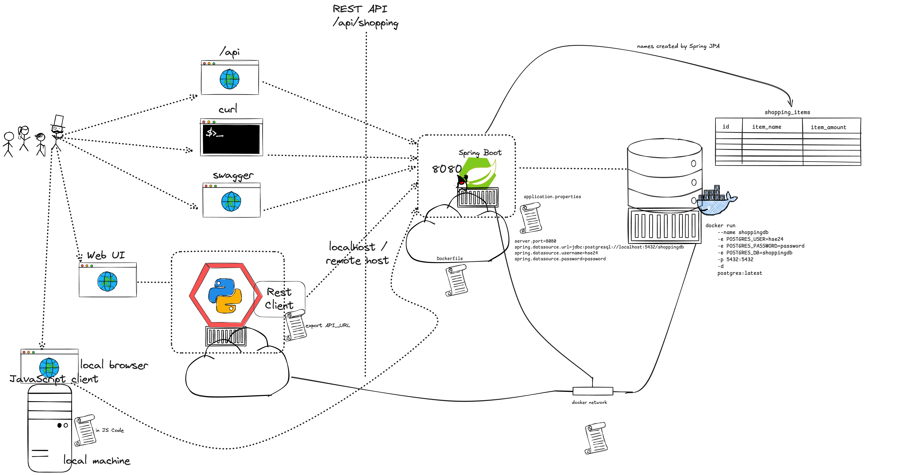

# hse-24-winter
Lecture description for HSE winter semester

# Initial brainstorming session

## **2024 / 09 / 23 - Introduction to distributed systems - Overview Cloud Computing**  

### **Content Overview**
1. **The NIST Cloud Definition (2011)**
   - Breakdown of the NIST’s five essential cloud characteristics, deployment models, and service models.
  
2. **Overview of Major Cloud Providers**
   - Key players in the cloud space (AWS, Azure, Google Cloud, etc.).
   - Comparing evolution.

3. **Cloud Service/Abstraction Models**
   - IaaS, PaaS, SaaS revisited, with modern examples.
   - The evolution of abstraction models, including FaaS and Containers-as-a-Service (CaaS).

4. **Introduction to CNCF**
   - Role of the Cloud Native Computing Foundation (CNCF) in the cloud ecosystem.
   - CNCF Landscape: technologies, tools, and projects.

5. **Popular Technologies**
   - **Kubernetes**: Container orchestration in cloud-native environments.
   - **eBPF**: Extending kernel capabilities for monitoring and security.
   - **OpenTelemetry**: Observability standards and practices in modern cloud systems.

---

### **Learning Objectives**
By the end of this lecture, students will be able to:
- Describe the NIST cloud definition and its significance in the modern cloud landscape.
- Identify the major cloud providers and tell about their evolution.
- Differentiate between cloud service models and discuss their evolution, including modern abstraction models like CaaS.
- Explain the role of CNCF and analyze the CNCF landscape to identify key technologies and trends.
- Provide an overview of Kubernetes, eBPF, and OpenTelemetry, explaining their impact on cloud-native development.

---

### **Student/Review Questions**
#### For now:
1. What are the five essential characteristics of cloud computing according to NIST, and how do they apply to modern cloud services?
2. Identify 3 main cloud providers.
3. What are the differences between IaaS, PaaS, and SaaS? Give examples of each in today's cloud ecosystem.
4. What is the CNCF, and why is it important in the context of cloud-native technologies?
#### For later:
5. How does Kubernetes help in managing containerized applications in cloud-native environments?
6. What is eBPF, and what advantages does it provide in terms of system monitoring and security?
7. Explain the role of OpenTelemetry in modern cloud systems. How does it contribute to observability?

---

### **Suggested Reading & Resources**
- [NIST 2011 Cloud Computing Definition](https://nvlpubs.nist.gov/nistpubs/Legacy/SP/nistspecialpublication800-145.pdf)
- CNCF [Cloud Native Landscape](https://landscape.cncf.io/)
- [Introduction to Kubernetes](https://kubernetes.io/docs/tutorials/)
- [Understanding eBPF](https://ebpf.io/)
- [OpenTelemetry Documentation](https://opentelemetry.io/docs/)

---

### Homework

- Get a GitHub or GitLab or Bitbucket account

## **2024 / 09 / 30 - Overview of distributed systems implementation options - Frameworks, Kubernetes, Service Meshes (sidecar-based and eBPF-based)**

## **2024 / 09 / 30 - Cloud-based IDEs**
### **Content Overview**

1. **Reasons for Distributed Systems: Heterogeneity and Resilience**
   - Why distributed systems? The need for handling heterogeneous environments (multiple platforms, languages, and architectures).
   - Achieving resilience in modern systems: ensuring fault tolerance, scalability, and high availability in distributed environments.

2. **Implementation Options for Distributed Systems**
   - Overview of software frameworks for distributed systems (e.g., Spring Boot).
   - Platforms enabling distributed architectures: Kubernetes and its orchestration capabilities.
   - Extensions: service meshes (e.g., Istio, Linkerd) for enhancing communication and security.
   - Exploring new capabilities through eBPF for controlling network traffic.

3. **Overview of Cloud-Based IDEs**
   - Introduction to cloud-based integrated development environments (IDEs).
   - **GitHub Codespaces**: Full development environments in the cloud.
   - **Gitpod**: Automating and provisioning cloud-based workspaces for development.
   - Benefits of cloud-based IDEs for distributed systems development.

---

### **Learning Objectives**
By the end of this lecture, students will be able to:
- Explain the importance of heterogeneity and resilience as key drivers for distributed systems.
- Identify different implementation options for building distributed systems using frameworks, platforms, and extensions.
- Compare the features of traditional service meshes and newer approaches leveraging eBPF.
- Explain the advantages of using cloud-based IDEs, such as GitHub Codespaces and Gitpod, for distributed system development.
- Demonstrate an understanding of how these tools enhance collaboration and scalability in cloud-native environments.

---

### **Student/Review Questions**
1. Why are heterogeneity and resilience important factors in the design of distributed systems?
2. What are the main differences between a software framework (e.g., Spring Boot) and a platform (e.g., Kubernetes) when building distributed systems?
3. How do service meshes like Istio or Linkerd improve communication in microservices architectures?
4. What is eBPF, and how does it enhance service mesh capabilities in modern cloud-native systems?
5. Analyze GitHub Codespaces and Gitpod. What are the key features that make them suitable for developing distributed systems?
6. What are the main benefits of using cloud-based IDEs compared to traditional, local development environments?

---

### **Suggested Reading & Resources**
- [Introduction to Spring Boot for Microservices](https://spring.io/projects/spring-boot)
- [Kubernetes Documentation](https://kubernetes.io/docs/home/)
- [Service Mesh Overview](https://istio.io/latest/docs/concepts/what-is-istio/)
- [eBPF - A New Frontier](https://ebpf.io/)
- [GitHub Codespaces Documentation](https://github.com/features/codespaces)
- [Gitpod Documentation](https://www.gitpod.io/docs)

## **2024 / 10 / 7 - Containers**
### Content Overview

1. Development in distributed teams withouth containers and the potential problems:
   - Polyglot application landscapes are challenging as all work environments need to match all runtime requirements for all languages
   - Transporting application from environment A to environment B introduces challenges and problems with mismatching runtimes

   

2. **Containers**
   - Isolate Applications from each other
   - Package Applications along with all Runtime requirements for easy execution and transportation between working environments
   - Simplify configuration of working environments -> only container engine needed
   - handling of all application containers through same mechanisms: docker build, docker run

   

3. **Docker**
   - Docker ecosystem consists of the Docker Daemon, Docker CLI and Docker Hub+
   - Creation of Dockerfiles
   - Building Images
   - Running Containers

4. **Exercises**
   - Exercises can be found at: https://lecture.new.trainings.nvtc.io/basics/container/

### **Student/Review Questions**
1. What is Docker, and how does it differ from traditional virtual machines?
2. Explain the concept of a Docker image and a Docker container. How are they related?
3. What are the main components of a Dockerfile? Describe the purpose of each component.
4. How does Docker ensure isolation and security between containers?
5. What is a container registry, and how do you use Docker Hub to share or deploy images?
6. Describe the process of building and running a containerized application using Docker, including common commands.

### Homework
- Get a Dockerhub account
- Work through the exercises

---

## **2024 / 10 / 14 - Multi-Container Applications with Docker **

   

### **Content Overview**
1. **Multi-Container Applications**
   - Introduction to the concept of multi-container applications.
   - Understanding container isolation: how containers are isolated from each other and the host system to ensure security and resource control.
   - **Port Mapping**: How port mapping allows external access to containerized applications while maintaining isolation between the container and the host network.
   - **Executing a Shell in a Container for Debugging**: Using Docker to open a shell inside a running container to troubleshoot issues, inspect processes, or test the environment.

   

2. **Creating Containerized Applications with Spring Boot**
   - Building containerized applications using pre-built Spring Boot code.
   - Writing and using Dockerfiles to package Spring Boot applications into containers.

3. **Connecting Containers Using Docker Networks**
   - Overview of Docker networking and its role in enabling communication between containers.
   - Different types of Docker networks (bridge, host).

4. **Docker Compose for Multi-Container Applications**
   - Introduction to Docker Compose and its benefits for managing multi-container applications.
   - Creating and running multi-container setups using `docker-compose.yml` to define and orchestrate services.

---

### **Learning Objectives**
By the end of this lecture, students will be able to:
- Explain the concept of multi-container applications and the importance of container isolation, including port mapping and shell access for debugging.
- Create containerized Spring Boot applications using Dockerfiles.
- Set up Docker networks to connect multiple containers and enable communication.
- Use Docker Compose to define and manage multi-container applications in a streamlined way.

---

### **Student/Review Questions**
1. What is container isolation, and why is it important in multi-container applications?
2. How does port mapping work, and how does it maintain isolation between a container and the host system while allowing external access?
3. How can you execute a shell inside a running container to debug an application? Provide an example of when this might be useful.
4. How would you create a Dockerfile for a Spring Boot application to package it into a container?
5. What is the role of Docker networks in multi-container applications, and what are the different network types?
6. How does Docker Compose simplify the management of multi-container applications? Provide an example of how services are defined in a `docker-compose.yml` file.
7. What are some advantages of using Docker Compose over manually running multiple containers with Docker commands?

---

### **Suggested Reading & Resources**
- [Spring Boot Docker Guide](https://spring.io/guides/gs/spring-boot-docker/)
- [Docker Networking Overview](https://docs.docker.com/network/)
- [Docker Port Mapping](https://docs.docker.com/config/containers/container-networking/#published-ports)
- [Using Docker Exec for Debugging](https://docs.docker.com/engine/reference/commandline/exec/)
- [Docker Compose Documentation](https://docs.docker.com/compose/)
- [Best Practices for Multi-Container Applications](https://www.docker.com/blog/best-practices-for-writing-dockerfiles/)

---

### Homework
- **DO THE DOCKER EXERCISES**

## **2024 / 10 / 21 - Spring Boot Introduction & Cloud-based IDEs** 

### **Content Overview**

1. **Introduction to Spring Boot**
   - **Evolution of Spring to Spring Boot**: Understanding how Spring Boot simplifies Spring applications, focusing on convention over configuration.
   - **Spring Initializr**: A web-based tool for quickly creating Spring Boot projects with customizable dependencies.
   - **Key Dependencies**:
     - **Web**: Building RESTful web services and web applications.
     - **Actuator**: Providing production-ready features such as monitoring and health checks.
   - **application.properties**: Configuration of application settings in Spring Boot projects.
   - **Spring Boot Project Structure**: Understanding the typical structure of a Spring Boot project and how it facilitates development.
   - **OpenAPI**: Use the OpenAPI dependency to make the REST API definition universally available and accessible through a JSON format and the Swagger UI

2. **Overview of Cloud-Based IDEs**
   - **GitHub Codespaces**: Cloud-hosted development environments integrated with GitHub, enabling easy setup and collaboration.
   - **Gitpod**: Automating cloud-based development workspaces with pre-configured environments.
   - Advantages of cloud-based IDEs for Spring Boot development: instant setup, collaboration, and scalability.

---

### **Learning Objectives**
By the end of this lecture, students will be able to:
- Describe the evolution of Spring to Spring Boot and how Spring Boot improves application development.
- Use Spring Initializr to create Spring Boot projects with appropriate dependencies.
- Understand and configure application properties using `application.properties` in Spring Boot.
- Identify the key components and structure of a typical Spring Boot project.
- Create a REST API using Spring Boot by using common annotations.
- Extend the Spring Boot dependencies to use OpenAPI and Swagger UI.
- Compare GitHub Codespaces and Gitpod, and explain how cloud-based IDEs enhance Spring Boot development workflows.

---

### **Student/Review Questions**
1. Describe basic core concepts of Spring Boot.
2. How does Spring Initializr simplify the creation of Spring Boot projects, and what are some essential dependencies you might include?
3. What role does the `application.properties` file play in a Spring Boot project?
4. Explain the typical structure of a Spring Boot project. Why is this structure useful for developers?
5. What do the annotations `@RestController`, `@PathVariable` and `@RequestMapping` do?
6. What are the key benefits of using a cloud-based IDE over a local development environment for a cloud-native application in general and a Spring Boot project in particular?

---

### **Suggested Reading & Resources**
- [Spring Boot Documentation](https://spring.io/projects/spring-boot)
- [Spring Initializr](https://start.spring.io/)
- [Spring Boot Actuator Documentation](https://docs.spring.io/spring-boot/docs/current/reference/html/actuator.html)
- [GitHub Codespaces Documentation](https://github.com/features/codespaces)
- [Gitpod Documentation](https://www.gitpod.io/docs)

### Homework
- **Rebuild the sample of the lecture**

Here's the documentation for today’s longer lecture:

---

## **2024 / 10 / 28 - Cloud-Native Theory and REST APIs**  

### **Content Overview**

1. **Distributed Systems Theory**
   - **CAP Theorem**: Understanding the trade-offs between Consistency, Availability, and Partition Tolerance in distributed systems.
   - **Conway's Law**: Exploring how software design reflects organizational structure and its implications for distributed systems.
   - **12-Factor Applications**: Best practices for building scalable, maintainable applications, focusing on principles like configuration, dependencies, and logging.
   - **Microservices**: Basic concept of microservices, its advantages, and challenges in distributed systems.

2. **API and REST**
   - **HTTP Basics**: Core concepts of HTTP for APIs, including request/response structure.
   - **Introduction to REST**: Understanding the foundational ideas of REST as defined by Roy Fielding and how RESTful APIs communicate.
   - **Nouns and Verbs**: Structuring REST APIs around resources (nouns) and actions (verbs).
   - **Representation**: Data formats in REST (e.g., JSON, XML) and the role of content negotiation.
   - **HTTP Return Codes**: Standard HTTP status codes, their meanings, and when to use each in API responses.
   - **Idempotency**: Ensuring repeatable requests yield the same results to prevent unintended side effects.
   - **Richardson's Maturity Model**: Levels of RESTful maturity, from Level 0 (HTTP as a tunnel) to Level 3 (HATEOAS), to understand API design progression.

---

### **Learning Objectives**
By the end of this lecture, students will be able to:
- Describe the CAP Theorem, its components, and how it affects design choices in distributed systems.
- Explain Conway’s Law and its influence on software architecture, especially in the context of microservices.
- List and apply the 12 factors for building scalable, portable, and maintainable applications.
- Define and differentiate microservices architecture from other architectural styles.
- Understand and apply REST principles, including HTTP methods, status codes, and idempotency, to design effective APIs.
- Recognize different levels of RESTful API maturity and their implications for API design.

### **ABOVE ALL**

Be able to relate the concepts of CAP theorem and the 12-factor apps to the technologies we are covering in the lecture,
e.g. how do technologies like Spring Boot (or other frameworks/languages), Docker, Kubernetes incorporate or implement those aspects

---

### **Student/Review Questions**
1. What are the components of the CAP Theorem, and why can’t a distributed system fully achieve all three?
2. How does Conway’s Law impact the structure of a distributed system, especially when adopting a microservices architecture?
3. What are the key factors of a 12-factor app, and how do they contribute to application scalability and resilience?
4. Describe microservices concepts and some of its advantages over a monolithic architecture.
5. What are the basic components of HTTP and their role in RESTful APIs?
6. Who is Roy Fielding, and what are the core principles of REST as outlined in his dissertation?
7. In RESTful API design, why is it essential to distinguish between nouns and verbs? Provide an example of an appropriate noun-verb pairing in a REST API.
8. List at least three common HTTP status codes and explain their meanings.
9. What is idempotency, and why is it important in the context of REST APIs? Provide an example of an idempotent HTTP method.
10. Describe the levels of Richardson’s Maturity Model. Why is each level a step toward a more RESTful API?

---

### **Suggested Reading & Resources**
- [Understanding the CAP Theorem](https://cs.uwaterloo.ca/~kmsalem/courses/CS848/W16/readings/cap.pdf)
- [Conway’s Law - A Key Consideration in Architecture](https://www.thoughtworks.com/insights/blog/conways-law-and-modern-software-factories)
- [The Twelve-Factor App](https://12factor.net/)
- [Microservices Architecture Documentation](https://microservices.io/patterns/microservices.html)
- [Roy Fielding’s REST Dissertation](https://www.ics.uci.edu/~fielding/pubs/dissertation/rest_arch_style.htm)
- [HTTP Status Codes](https://developer.mozilla.org/en-US/docs/Web/HTTP/Status)
- [Richardson's Maturity Model](https://martinfowler.com/articles/richardsonMaturityModel.html)

## **2024 / 11 / 04 - 12-factor configuration recap and lab lookout**  

### **Content Overview**

1. **Recap of 12-Factor Configuration**
   - **Separation of Configuration from Code**: Reinforcing the principle of externalizing configuration to make applications more flexible and scalable, especially in distributed environments.
   - **Environment Variables for Configuration**: Understanding the use of environment variables for managing application settings across various environments (development, staging, production).
   - **Configuration in Modern Technologies**:
     - **Spring Boot**: Managing settings such as database connections and ports using `application.properties` or `application.yml` files to keep them outside the core application logic.
     - **Docker**: Externalizing configuration with `docker-compose` files, `docker run` commands (e.g., `-e` for environment variables and `-p` for port mapping), and avoiding hardcoding in Dockerfiles to support flexibility.
     - **Kubernetes**: Using ConfigMaps and Secrets to manage application settings, making it easy to adjust configurations dynamically without rebuilding containers.

2. **Lookout on lab**

---

### **Learning Objectives**
By the end of this lecture, students will be able to:
- Explain the importance of separating configuration from code, specifically in the context of distributed systems.
- Relate the configuration principle of the 12-factor methodology to technologies such as Spring Boot, Docker, and Kubernetes.
- Describe how these technologies implement configuration externalization to support flexibility, scalability, and best practices in distributed systems.
- Discuss the impact of improper configuration management in distributed systems and the challenges of maintaining dynamic configuration across different environments.

---

### **Student/Review Questions**

1. Describe the configuration factor in the 12-factor methodology. Why is it essential for distributed systems, and how is it implemented in Spring Boot, Docker, and Kubernetes?  
   *Example Answer: In distributed systems, configuration often varies between environments. Spring Boot uses `application.properties` files for settings like database connections and ports, Docker supports configuration via `docker-compose` and `docker run` options, and Kubernetes uses ConfigMaps and Secrets.*

2. What happens if you store port configuration directly in your source code?  
   *Answer: The port configuration becomes fixed, requiring a rebuild of the application if changes are needed. Externalizing this allows easy updates without code changes.*

3. Why is external configuration more crucial for a distributed system than a monolithic application?  
   *Answer: Distributed systems often require dynamic configuration changes across multiple services or containers, whereas monolithic applications generally have fewer, more static configuration needs.*

4. Why isn’t the Dockerfile suited for storing external configurations? How can you apply configurations in a Docker environment?  
   *Answer: Dockerfiles are designed for building images, not for external settings that may change. Configuration should be applied at runtime using `docker-compose` or the `docker run` command with `-e` for environment variables and `-p` for port mapping.*

---

### **Suggested Reading & Resources**
- [The Twelve-Factor App: Configuration](https://12factor.net/config)
- [Spring Boot Externalized Configuration](https://docs.spring.io/spring-boot/docs/current/reference/html/application-properties.html)
- [Docker Environment Variables and Configurations](https://docs.docker.com/compose/environment-variables/)
- [Kubernetes ConfigMaps and Secrets](https://kubernetes.io/docs/concepts/configuration/)

---

## 2024-11-11 **Spring Data and overall lab build**

   

### **Content Overview**

1. **Introduction to Persistence, ORM, Spring Data, and Spring Data JPA**
   - **Persistence**: Covered the importance of persistence in applications, which allows data to be stored and retrieved across sessions and restarts. Explained why a database-backed approach is preferable for production applications compared to in-memory solutions like `ArrayList`.
   - **Object-Relational Mapping (ORM)**: Introduced ORM as a technique for mapping application objects to database tables, simplifying data manipulation and reducing boilerplate code. Explained ORM’s role in enabling more seamless interactions with relational databases.
   - **Spring Data**: Provided an overview of Spring Data, a Spring module that simplifies data access by reducing repetitive code and offering a consistent programming model across data storage types.
   - **Spring Data JPA**: Discussed Spring Data JPA as a specialized implementation of Spring Data tailored to Java Persistence API (JPA) usage, allowing us to interact with relational databases using repository interfaces. Explained the benefits of JPA repositories, including CRUD operations and query generation.

2. **Spring Boot Application Enhancements**  
   - Transitioned the shopping list app from using an `ArrayList` for storage to a relational database with **Spring Data JPA** and **PostgreSQL** integration.
   - Created endpoints for CRUD operations, implemented a repository interface to manage shopping list items, and added a custom `getItemByName` method.
   - Added logic to handle duplicate item names by increasing their amount instead of creating new entries, leveraging Spring Data JPA’s powerful querying capabilities.

3. **Flask Frontend Setup**  
   - Developed a **Flask frontend** to interact with the Spring Boot API, allowing students to create a basic user interface for interacting with the shopping list.
   - Configured the Flask app to read the **API URL** from an environment variable, supporting flexible connections to the backend environment.
   - Verified that the Flask interface could successfully perform actions such as adding, updating, and deleting items on the shopping list by interacting with the REST API endpoints.

4. **Dockerizing the Spring Boot and Flask Applications**  
   - Guided students through creating a Docker image for the Spring Boot app and the Flask frontend, along with configuration of a **Docker Compose** file to orchestrate both services along with PostgreSQL.
   - Demonstrated how **Docker Compose** enables easy deployment and configuration of multi-container applications by defining all components in a single, reusable setup file.
   - Discussed best practices for containerizing the Spring Boot app with PostgreSQL for persistence and the Flask app for frontend interactions, ensuring portability and streamlined setup for the full application stack.

---

### **Objectives and Exercises**

*Students should be able to:*

- Explain the concepts of **persistence** and **ORM** and identify their importance in distributed, database-driven applications.
- Set up **Spring Data JPA** to interact with a relational database and configure it using Docker Compose.
- Describe the benefits of Dockerization for both frontend and backend applications and use **Docker Compose** to manage and deploy a complete multi-container setup.

*Exercise*:
Use this as a reference implementation to build your component as described in [Lab Exercise](./LABS.md)

---

### **Student/Review Questions**

1. **What is Object-Relational Mapping (ORM), and why is it beneficial for a database-backed application?**  

2. **Explain how Spring Data JPA helps in managing CRUD operations in a database.**  

3. **How does Docker Compose facilitate the deployment and management of the Spring Boot app, Flask frontend, and PostgreSQL database in a single environment?**  

4. **Describe the purpose of externalizing configuration, and explain how it was implemented in this lab using Docker and environment variables.**  

5. **Why is enabling a non-localhost API connection important for a frontend service like Flask, and how does Docker Compose make this possible?**  
