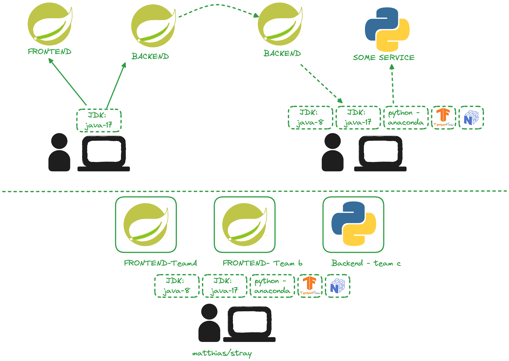
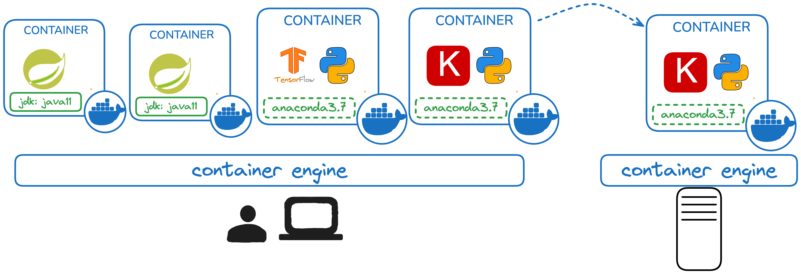

# hse-24-winter
Lecture description for HSE winter semester

# Initial brainstorming session

## **2024 / 09 / 23 - Introduction to distributed systems - Overview Cloud Computing**  

### **Content Overview**
1. **The NIST Cloud Definition (2011)**
   - Breakdown of the NIST’s five essential cloud characteristics, deployment models, and service models.
  
2. **Overview of Major Cloud Providers**
   - Key players in the cloud space (AWS, Azure, Google Cloud, etc.).
   - Comparing evolution.

3. **Cloud Service/Abstraction Models**
   - IaaS, PaaS, SaaS revisited, with modern examples.
   - The evolution of abstraction models, including FaaS and Containers-as-a-Service (CaaS).

4. **Introduction to CNCF**
   - Role of the Cloud Native Computing Foundation (CNCF) in the cloud ecosystem.
   - CNCF Landscape: technologies, tools, and projects.

5. **Popular Technologies**
   - **Kubernetes**: Container orchestration in cloud-native environments.
   - **eBPF**: Extending kernel capabilities for monitoring and security.
   - **OpenTelemetry**: Observability standards and practices in modern cloud systems.

---

### **Learning Objectives**
By the end of this lecture, students will be able to:
- Describe the NIST cloud definition and its significance in the modern cloud landscape.
- Identify the major cloud providers and tell about their evolution.
- Differentiate between cloud service models and discuss their evolution, including modern abstraction models like CaaS.
- Explain the role of CNCF and analyze the CNCF landscape to identify key technologies and trends.
- Provide an overview of Kubernetes, eBPF, and OpenTelemetry, explaining their impact on cloud-native development.

---

### **Student/Review Questions**
#### For now:
1. What are the five essential characteristics of cloud computing according to NIST, and how do they apply to modern cloud services?
2. Identify 3 main cloud providers.
3. What are the differences between IaaS, PaaS, and SaaS? Give examples of each in today's cloud ecosystem.
4. What is the CNCF, and why is it important in the context of cloud-native technologies?
#### For later:
5. How does Kubernetes help in managing containerized applications in cloud-native environments?
6. What is eBPF, and what advantages does it provide in terms of system monitoring and security?
7. Explain the role of OpenTelemetry in modern cloud systems. How does it contribute to observability?

---

### **Suggested Reading & Resources**
- [NIST 2011 Cloud Computing Definition](https://nvlpubs.nist.gov/nistpubs/Legacy/SP/nistspecialpublication800-145.pdf)
- CNCF [Cloud Native Landscape](https://landscape.cncf.io/)
- [Introduction to Kubernetes](https://kubernetes.io/docs/tutorials/)
- [Understanding eBPF](https://ebpf.io/)
- [OpenTelemetry Documentation](https://opentelemetry.io/docs/)

---

### Homework

- Get a GitHub or GitLab or Bitbucket account

## **2024 / 09 / 30 - Overview of distributed systems implementation options - Frameworks, Kubernetes, Service Meshes (sidecar-based and eBPF-based)**

## **2024 / 09 / 30 - Cloud-based IDEs**
### **Content Overview**

1. **Reasons for Distributed Systems: Heterogeneity and Resilience**
   - Why distributed systems? The need for handling heterogeneous environments (multiple platforms, languages, and architectures).
   - Achieving resilience in modern systems: ensuring fault tolerance, scalability, and high availability in distributed environments.

2. **Implementation Options for Distributed Systems**
   - Overview of software frameworks for distributed systems (e.g., Spring Boot).
   - Platforms enabling distributed architectures: Kubernetes and its orchestration capabilities.
   - Extensions: service meshes (e.g., Istio, Linkerd) for enhancing communication and security.
   - Exploring new capabilities through eBPF for controlling network traffic.

3. **Overview of Cloud-Based IDEs**
   - Introduction to cloud-based integrated development environments (IDEs).
   - **GitHub Codespaces**: Full development environments in the cloud.
   - **Gitpod**: Automating and provisioning cloud-based workspaces for development.
   - Benefits of cloud-based IDEs for distributed systems development.

---

### **Learning Objectives**
By the end of this lecture, students will be able to:
- Explain the importance of heterogeneity and resilience as key drivers for distributed systems.
- Identify different implementation options for building distributed systems using frameworks, platforms, and extensions.
- Compare the features of traditional service meshes and newer approaches leveraging eBPF.
- Explain the advantages of using cloud-based IDEs, such as GitHub Codespaces and Gitpod, for distributed system development.
- Demonstrate an understanding of how these tools enhance collaboration and scalability in cloud-native environments.

---

### **Student/Review Questions**
1. Why are heterogeneity and resilience important factors in the design of distributed systems?
2. What are the main differences between a software framework (e.g., Spring Boot) and a platform (e.g., Kubernetes) when building distributed systems?
3. How do service meshes like Istio or Linkerd improve communication in microservices architectures?
4. What is eBPF, and how does it enhance service mesh capabilities in modern cloud-native systems?
5. Analyze GitHub Codespaces and Gitpod. What are the key features that make them suitable for developing distributed systems?
6. What are the main benefits of using cloud-based IDEs compared to traditional, local development environments?

---

### **Suggested Reading & Resources**
- [Introduction to Spring Boot for Microservices](https://spring.io/projects/spring-boot)
- [Kubernetes Documentation](https://kubernetes.io/docs/home/)
- [Service Mesh Overview](https://istio.io/latest/docs/concepts/what-is-istio/)
- [eBPF - A New Frontier](https://ebpf.io/)
- [GitHub Codespaces Documentation](https://github.com/features/codespaces)
- [Gitpod Documentation](https://www.gitpod.io/docs)

## **2024 / 10 / 7 - Containers**
### Content Overview

1. Development in distributed teams withouth containers and the potential problems:
   - Polyglot application landscapes are challenging as all work environments need to match all runtime requirements for all languages
   - Transporting application from environment A to environment B introduces challenges and problems with mismatching runtimes

   

2. **Containers**
   - Isolate Applications from each other
   - Package Applications along with all Runtime requirements for easy execution and transportation between working environments
   - Simplify configuration of working environments -> only container engine needed
   - handling of all application containers through same mechanisms: docker build, docker run

   

3. **Docker**
   - Docker ecosystem consists of the Docker Daemon, Docker CLI and Docker Hub+
   - Creation of Dockerfiles
   - Building Images
   - Running Containers

4. **Exercises**
   - Exercises can be found at: https://lecture.new.trainings.nvtc.io/basics/container/

### **Student/Review Questions**
1. What is Docker, and how does it differ from traditional virtual machines?
2. Explain the concept of a Docker image and a Docker container. How are they related?
3. What are the main components of a Dockerfile? Describe the purpose of each component.
4. How does Docker ensure isolation and security between containers?
5. What is a container registry, and how do you use Docker Hub to share or deploy images?
6. Describe the process of building and running a containerized application using Docker, including common commands.

### Homework
- Get a Dockerhub account
- Work through the exercises

---

### ## **2024 / 10 / 7 - Multi-Container Applications with Docker **

   

### **Content Overview**
1. **Multi-Container Applications**
   - Introduction to the concept of multi-container applications.
   - Understanding container isolation: how containers are isolated from each other and the host system to ensure security and resource control.
   - **Port Mapping**: How port mapping allows external access to containerized applications while maintaining isolation between the container and the host network.
   - **Executing a Shell in a Container for Debugging**: Using Docker to open a shell inside a running container to troubleshoot issues, inspect processes, or test the environment.

   

2. **Creating Containerized Applications with Spring Boot**
   - Building containerized applications using pre-built Spring Boot code.
   - Writing and using Dockerfiles to package Spring Boot applications into containers.

3. **Connecting Containers Using Docker Networks**
   - Overview of Docker networking and its role in enabling communication between containers.
   - Different types of Docker networks (bridge, host).

4. **Docker Compose for Multi-Container Applications**
   - Introduction to Docker Compose and its benefits for managing multi-container applications.
   - Creating and running multi-container setups using `docker-compose.yml` to define and orchestrate services.

---

### **Learning Objectives**
By the end of this lecture, students will be able to:
- Explain the concept of multi-container applications and the importance of container isolation, including port mapping and shell access for debugging.
- Create containerized Spring Boot applications using Dockerfiles.
- Set up Docker networks to connect multiple containers and enable communication.
- Use Docker Compose to define and manage multi-container applications in a streamlined way.

---

### **Student/Review Questions**
1. What is container isolation, and why is it important in multi-container applications?
2. How does port mapping work, and how does it maintain isolation between a container and the host system while allowing external access?
3. How can you execute a shell inside a running container to debug an application? Provide an example of when this might be useful.
4. How would you create a Dockerfile for a Spring Boot application to package it into a container?
5. What is the role of Docker networks in multi-container applications, and what are the different network types?
6. How does Docker Compose simplify the management of multi-container applications? Provide an example of how services are defined in a `docker-compose.yml` file.
7. What are some advantages of using Docker Compose over manually running multiple containers with Docker commands?

---

### **Suggested Reading & Resources**
- [Spring Boot Docker Guide](https://spring.io/guides/gs/spring-boot-docker/)
- [Docker Networking Overview](https://docs.docker.com/network/)
- [Docker Port Mapping](https://docs.docker.com/config/containers/container-networking/#published-ports)
- [Using Docker Exec for Debugging](https://docs.docker.com/engine/reference/commandline/exec/)
- [Docker Compose Documentation](https://docs.docker.com/compose/)
- [Best Practices for Multi-Container Applications](https://www.docker.com/blog/best-practices-for-writing-dockerfiles/)

---

### Homework
- **DO THE DOCKER EXERCISES**
